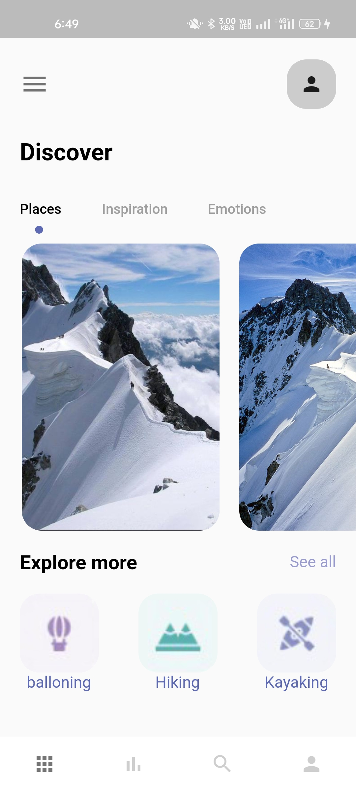
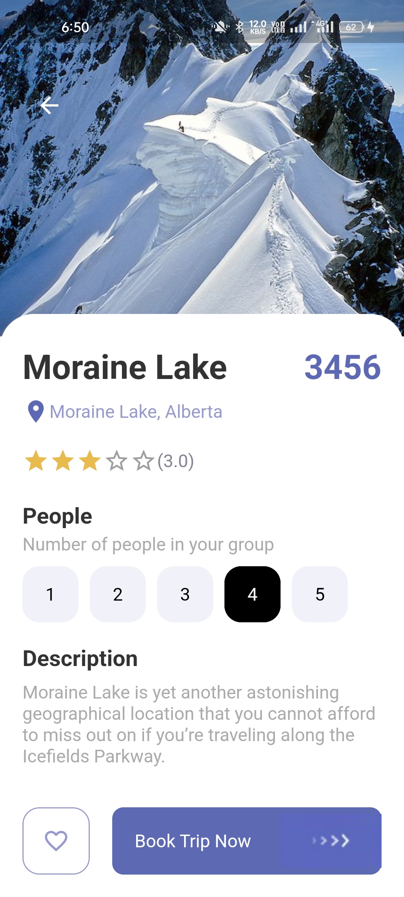

<h1 align="center">
     
    Travel App in Flutter
</h1>
<h4 align="start">
 This is a basic mobile application that uses the flutter framework to create a clone of the Tik Tok App.
</h4>

### Some Screenshots

  

## Getting Started

This project is a starting point for a Flutter application.

A few resources to get you started if this is your first Flutter project:

- [Lab: Write your first Flutter app](https://docs.flutter.dev/get-started/codelab)
- [Cookbook: Useful Flutter samples](https://docs.flutter.dev/cookbook)

For help getting started with Flutter development, view the
[online documentation](https://docs.flutter.dev/), which offers tutorials,
samples, guidance on mobile development, and a full API reference.
# Travel-App
